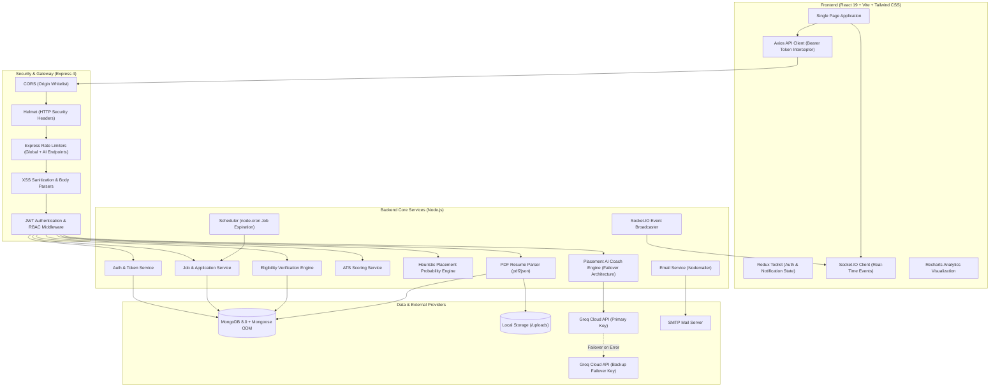
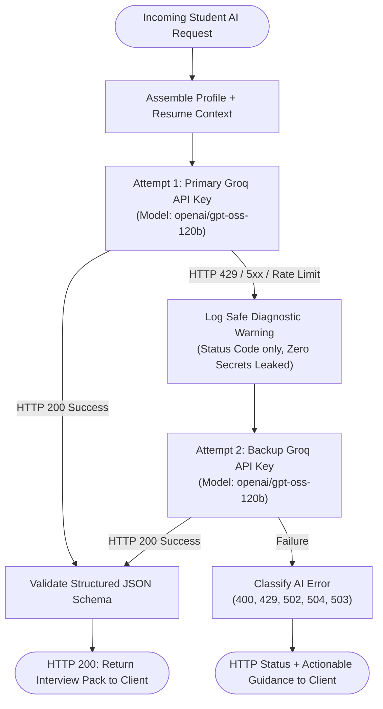
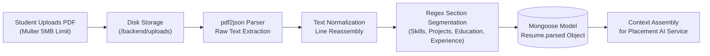
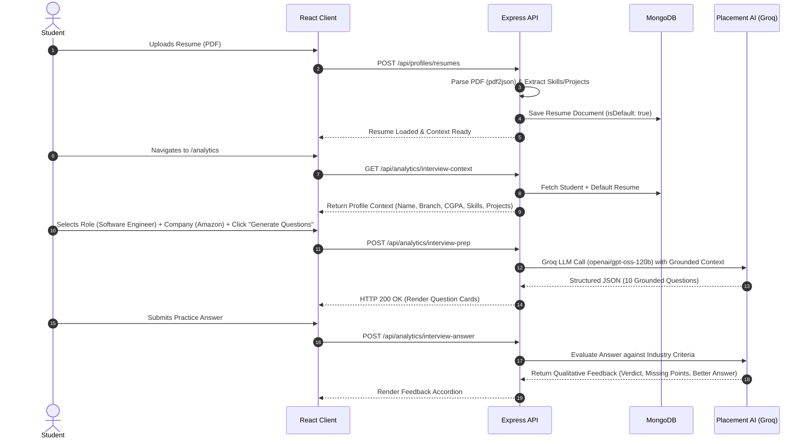
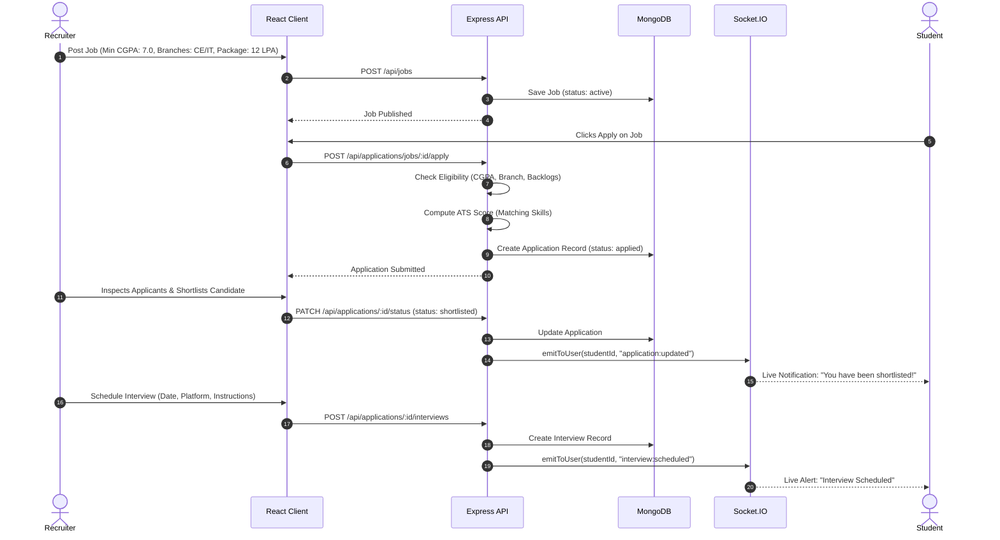

<div align="center">

# 🎓 PlacementOS
### AI-Powered Smart College Placement Management System

<p align="center">
  <strong>A centralized full-stack MERN ecosystem connecting students, recruiters, and placement officers with intelligent resume parsing, automated eligibility verification, and AI-powered interview preparation.</strong>
</p>

[](https://react.dev/)
[](https://vitejs.dev/)
[](https://tailwindcss.com/)
[](https://nodejs.org/)
[](https://www.mongodb.com/)
[](https://groq.com/)
[](https://socket.io/)
[](https://jwt.io/)

</div>

---

## 📌 Table of Contents

- [Overview](#-overview)
- [Problem Statement](#-problem-statement)
- [Project Objectives](#-project-objectives)
- [System Architecture](#-system-architecture)
- [Key Features by Role](#-key-features-by-role)
- [AI & Intelligent Placement Engine](#-ai--intelligent-placement-engine)
- [Resume Processing Pipeline](#-resume-processing-pipeline)
- [User Roles & Authorization](#-user-roles--authorization)
- [System Workflows](#-system-workflows)
- [Technology Stack](#-technology-stack)
- [Repository Structure](#-project-structure)
- [Prerequisites](#-prerequisites)
- [Installation & Setup](#-installation--setup)
- [Environment Configuration](#-environment-configuration)
- [Running the Application](#-running-the-application)
- [Available Scripts](#-available-scripts)
- [Authentication & Security](#-authentication--security)
- [API Reference](#-api-reference)
- [Database Models](#-database-models)
- [Screenshots & UI Showcase](#-screenshots--ui-showcase)
- [Usage Walkthrough](#-usage-walkthrough)
- [Testing & Quality Assurance](#-testing--quality-assurance)
- [Troubleshooting](#-troubleshooting)
- [Known Limitations](#-known-limitations)
- [Future Enhancements](#-future-enhancements)
- [Academic Context & Team](#-academic-context--team)
- [License](#-license)

---

## 📖 Overview

**PlacementOS (AI-Powered Smart College Placement Management System)** is a comprehensive full-stack platform designed to streamline, modernize, and digitize the campus placement lifecycle in academic institutions. 

Traditional campus recruitment relies heavily on fragmented spreadsheets, manual notice boards, physical resume handoffs, and disconnected communication channels. PlacementOS unifies **Students**, **Corporate Recruiters**, and **College Placement Officers / Administrators** into a single cohesive SaaS platform:

```
Student Profile & Resume ➔ Job Discovery ➔ Eligibility Verification ➔ Application & Tracking ➔ AI Interview Prep ➔ Shortlisting & Scheduling ➔ Placement Analytics
```

### Core Value Proposition

| Stakeholder | Primary Value Delivered |
| :--- | :--- |
| **Students** | Centralized profile & resume repository, automated eligibility checking, transparent stage-by-stage application tracking, and resume-grounded AI mock interview practice. |
| **Recruiters** | Dedicated company profile management, structured job postings with strict academic cutoffs, instant ATS candidate matching, and integrated interview scheduling. |
| **Placement Cell (Admin)** | Centralized student and recruiter records, company and recruiter verification workflows, real-time departmental placement charts, campus announcements, and audit logging. |

---

## ❗ Problem Statement

College placement cells coordinate recruitment drives across hundreds of students and dozens of visiting companies each academic year. Conventional placement processes suffer from:

1. **Fragmented Workflows**: Academic records, resumes, job descriptions, and shortlists are scattered across Google Forms, spreadsheets, and emails.
2. **Error-Prone Eligibility Verification**: Manually filtering students by CGPA thresholds, allowable backlogs, and specific engineering branches leads to oversights and disputes.
3. **Lack of Transparent Tracking**: Students frequently have no visibility into whether their application was reviewed, shortlisted, or scheduled for an interview.
4. **Generic Interview Preparation**: Students lack personalized, company-targeted interview coaching grounded in their actual resumes and technical projects.
5. **Decentralized Placement Records**: Placement officers struggle to generate cohesive departmental conversion statistics, batch analytics, and compliance reports.

**PlacementOS** eliminates these bottlenecks by introducing an automated, authenticated, and transparent platform backed by heuristic matching and LLM-powered interview coaching.

---

## 🎯 Project Objectives

- **Digitize Recruitment Drives**: Replace manual paperwork and spreadsheets with secure, role-based digital workflows.
- **Automated Eligibility Auditing**: Instantly validate student criteria (CGPA, active backlogs, graduation batch, branch) against job requirements before allowing applications.
- **ATS Resume Match Scoring**: Compute keyword and skill alignment scores between candidate profiles and posted job specifications.
- **Resume-Grounded AI Interview Coaching**: Generate targeted technical, behavioral, and company-specific interview questions grounded in the student's actual parsed resume.
- **Real-Time Communication**: Push immediate status updates, interview schedules, and announcements via WebSockets (Socket.IO) and automated email notifications.
- **Institutional Analytics**: Provide visual department-wise placement distributions and hiring funnel metrics for administrative evaluation.

---

## 🏗️ System Architecture

PlacementOS follows a decoupled **Client-Server Architecture** utilizing an npm workspaces monorepo:



---

## ✨ Key Features by Role

### 👨‍🎓 Student Features
- **Student Profile Management**: Maintain academic records (branch, CGPA, graduation batch, active backlogs), personal biography, and technical skills tags.
- **Multi-Resume Management**: Upload multiple PDF resumes, view parsed extracted sections, delete outdated files, and select a **Default Resume** for applications and AI analysis.
- **Job Discovery & Eligibility Checks**: Browse verified campus drives with multi-parameter filtering (role, department, salary package). Click **Check Eligibility** for an instant pre-application audit detailing branch, CGPA, backlog, or skill mismatches.
- **One-Click Application & ATS Score**: Submit applications attaching the default resume. Receive an instant ATS match percentage highlighting matching skills and suggested additions.
- **Application Tracking**: Monitor live progress badges (`applied`, `under_review`, `shortlisted`, `interview_scheduled`, `selected`, `rejected`, `offer_released`).
- **Offer Letter Response**: Review official recruiter offers with CTC breakdown and directly accept or decline within the portal.
- **Placement Probability Score**: View a transparent heuristic score (0–100%) computed from CGPA, project count, skill diversity, and internship experience.

### 🏢 Recruiter Features
- **Company Profile Setup**: Manage corporate profile, headquarters location, website link, company overview, and logo image.
- **Account Verification Workflow**: Submit recruiter credentials for placement cell administrative review and verification before posting jobs.
- **Drive & Job Posting**: Create structured recruitment drives defining job title, role category, package (CTC), minimum CGPA, maximum allowable backlogs, eligible engineering branches, required skill tags, and application deadlines.
- **Applicant Pool Management**: Filter applicants per drive, inspect student profiles, review ATS match percentages, and download uploaded resumes.
- **Stage Progression & Interview Scheduling**: Advance candidate statuses, schedule technical or HR rounds (date, time, platform link, instructions), and dispatch automated notifications.
- **Offer Generation**: Issue formal employment offers with package and deadline details directly through the platform.

### 🛡️ Placement Officer & Admin Features
- **Verification & Approval Queue**: Review and formally approve or reject registering recruiters and newly created company profiles.
- **Job & Drive Governance**: Monitor active recruitment drives across campus with administrative authority to close or remove non-compliant postings.
- **Student & User Oversight**: Manage student and recruiter user accounts, update statuses, or remove invalid profiles.
- **Campus Announcements**: Broadcast campus-wide placement notifications, drive notices, and deadline alerts to all active students.
- **Placement Analytics**: Interactive visualizations showing branch-wise placement numbers (placed vs. registered students) and hiring conversion ratios.
- **Audit Logging**: Systematic audit record creation for administrative actions and sensitive state transitions.

---

## 🤖 AI & Intelligent Placement Engine

PlacementOS integrates a specialized, grounded AI Interview Coaching system powered by Groq (`openai/gpt-oss-120b`). The AI capabilities are purposefully engineered for placement preparation and strictly constrained to prevent hallucinations:

```
Student Profile Context + Parsed Resume Data + Target Role + Target Company ➔ Placement AI Service ➔ Structured JSON Interview Pack
```

### 1. Dual-Key Groq Failover Architecture
To ensure continuous availability during campus recruitment drives without hitting rate limits, the backend implements a resilient failover mechanism:



- **Primary Attempt**: Executes against `GROQ_PLACEMENT_API_KEY_PRIMARY`.
- **Failover Attempt**: If a transient provider error, rate limit, or auth glitch occurs, it automatically falls back to `GROQ_PLACEMENT_API_KEY_BACKUP`.
- **Zero Secret Exposure**: Diagnostic logging outputs provider status and elapsed duration without ever logging API keys, tokens, or raw resumes.
- **Strict Attempt Bound**: Exactly 1 primary attempt and 1 backup attempt — no concurrent duplicate calls and no infinite retry loops.

### 2. Implemented AI Features

| Capability | Purpose | Input Parameters | Processing & Grounding | Output Format |
| :--- | :--- | :--- | :--- | :--- |
| **Interview Question Generation** | Generates tailored technical, behavioral, and company-targeted interview questions. | Student profile, parsed resume, target role, target company, difficulty (`easy`, `medium`, `hard`, `mixed`), count (5–20), type (`technical`, `resume_based`, `project_based`, `behavioral`, `company_specific`). | Groq LLM evaluates candidate's specific tech stack and projects against target company hiring patterns. Enforces JSON object mode. | Array of structured questions containing: `category`, `difficulty`, `question`, `whyAsked`, `suggestedAnswer`, `keyPoints`, `commonMistake`, and `followUps`. |
| **Answer Practice & Evaluation** | Evaluates a student's self-written response to an interview question. | Question context, student's written response. | Evaluates clarity, technical depth, and alignment with industry standards. | Structured critique: `verdict` (`Strong`, `Good`, `Needs Improvement`), `whatWorkedWell`, `missingPoints`, `actionableAdvice`, `betterSampleAnswer`. |
| **Interviewer Follow-Up Generator** | Simulates realistic follow-up probing questions. | Question, candidate's response. | Analyzes potential weaknesses or architectural trade-offs in candidate's answer. | 2–3 probing follow-up questions simulating a senior engineering interviewer. |
| **Placement Coach Chatbot** | Interactive mentor providing pitch practice and placement guidance. | Student profile, resume, active role/company, user query. | Constrained mentor persona. Explicit grounding constraint: never invents internships, CGPA, or skills not in the student's profile. | Real-time conversational guidance, STAR-method structuring, and 30s/60s elevator pitch generation. |
| **ATS Resume Matcher** | Quantifies candidate alignment against a posted job. | Candidate skills (resume + profile), Job required skills. | Case-insensitive tokenization and set intersection matching (`atsService.js`). | 0–100% ATS score, array of matching skills, missing skills, and actionable improvement recommendations. |
| **Heuristic Placement Probability** | Computes readiness indicator on dashboard. | CGPA, skills count, project count, certifications, internships. | Weighted heuristic algorithm (`predictionService.js`): CGPA (max 70) + Skills (max 15) + Projects (max 8) + Certifications (max 5) + Internships (2). | Integer score (0–100%) with visual progress ring. |

---

## 📄 Resume Processing Pipeline

PlacementOS implements actual on-premise PDF text parsing without relying on third-party SaaS parsers:



1. **Upload & Validation**: Multipart form upload handled by Multer with strict MIME verification (`application/pdf`) and a 5MB size limit.
2. **Raw Text Extraction**: Uses pure JavaScript [`pdf2json`](https://github.com/modesty/pdf2json) to parse PDF stream dictionaries into decoded text buffers.
3. **Structured Regex Segmentation**: In [`resumeParserService.js`](file:///d:/Projects/AI-Powered-Smart-College-Placement-Management-System/backend/src/services/resumeParserService.js), raw text is segmented into:
   - `summary`: Candidate introduction or objective statement.
   - `skills`: Technical keywords mapped against a catalog of 200+ industry frameworks, languages, databases, and DevOps tools.
   - `projects`: Extracted project titles, descriptions, and detected tech stacks.
   - `education`: Degree, branch, university, and detected GPA/percentages.
   - `experience`: Internship and work history (company, role, duration).
   - `certifications` & `achievements`: Honors and accredited certifications.
4. **Auto-Reparsing Compatibility**: If an existing resume in MongoDB lacks structured fields, `reparseResumeIfIncomplete` automatically extracts the PDF file from disk upon the next context request and updates the database.

---

## 👥 User Roles & Authorization

The system enforces strict Role-Based Access Control (RBAC) via JWT middleware in [`backend/src/middlewares/auth.js`](file:///d:/Projects/AI-Powered-Smart-College-Placement-Management-System/backend/src/middlewares/auth.js):

| Role Identifier | Key Capabilities | Accessible Route Prefixes |
| :--- | :--- | :--- |
| **`student`** | Manage profile, upload/manage resumes, view hiring feed, check eligibility, apply for jobs, save jobs, respond to offers, access AI Interview Coach, receive notifications. | `/api/profiles/student`, `/api/profiles/resumes`, `/api/jobs/:id/eligibility`, `/api/jobs/saved`, `/api/applications/jobs/:id/apply`, `/api/analytics/interview-*`, `/api/analytics/ai/chat` |
| **`recruiter`** | Setup company profile, create/update/close job drives, review applicants, change candidate application status, schedule interviews, issue offers. | `/api/profiles/company`, `/api/jobs` (POST/PUT/PATCH), `/api/applications/:id/status`, `/api/applications/:id/interviews`, `/api/applications/:id/offers` |
| **`placement_officer`** / **`admin`** | Manage all users, approve recruiter accounts, verify company registrations, close non-compliant jobs, view campus placement statistics, publish announcements, generate reports. | `/api/admin/*`, `/api/analytics/dashboard`, `/api/analytics/branch-placements` |

---

## 🔄 System Workflows

### 1. Student Placement & AI Practice Workflow



### 2. Recruiter Drive & Hiring Funnel Workflow



---

## 💻 Technology Stack

### Frontend Architecture
| Package / Tool | Version | Purpose |
| :--- | :--- | :--- |
| **React** | `^19.0.0` | Declarative component-based user interface. |
| **Vite** | `^6.0.6` | Next-generation frontend tooling and production bundler. |
| **Tailwind CSS** | `^3.4.17` | Utility-first responsive CSS styling with clean SaaS aesthetics. |
| **React Router DOM** | `^7.1.1` | Client-side routing with protected route guards. |
| **Redux Toolkit** | `^2.5.0` | Global state management for authentication and notifications. |
| **Axios** | `^1.7.9` | Promise-based HTTP client with request interceptors and a 90s timeout. |
| **Recharts** | `^2.15.0` | Composable charting library for placement statistics. |
| **lucide-react** | `^0.468.0` | Professional, lightweight vector icons. |
| **Socket.IO Client** | `^4.8.1` | Real-time WebSocket connection for live notifications. |

### Backend Architecture
| Package / Tool | Version | Purpose |
| :--- | :--- | :--- |
| **Node.js** | `>=18.0.0` | JavaScript runtime environment. |
| **Express.js** | `^4.21.2` | REST API framework with route middleware architecture. |
| **MongoDB** | `>=7.0.0` | Document-oriented NoSQL database. |
| **Mongoose** | `^8.9.2` | Object Data Modeling (ODM) for schema validation and indexing. |
| **groq-sdk** | `^1.6.0` | Official SDK for high-speed inference on Groq hardware. |
| **pdf2json** | `^4.1.0` | Binary PDF text stream extraction without external C++ binaries. |
| **jsonwebtoken** | `^9.0.2` | Stateless authentication via signed JWT access and refresh tokens. |
| **bcryptjs** | `^2.4.3` | One-way salted password hashing. |
| **Socket.IO** | `^4.8.1` | Real-time bi-directional event communication. |
| **node-cron** | `^3.0.3` | Scheduled background cron job for expiring outdated job postings. |
| **nodemailer** | `^6.9.16` | SMTP email transport for status notifications. |
| **multer** | `^2.0.2` | Multipart form-data handling for resume PDF uploads. |
| **helmet** | `^8.0.0` | Sets secure HTTP response headers. |
| **cors** | `^2.8.5` | Cross-Origin Resource Sharing with port whitelisting. |
| **express-rate-limit** | `^7.5.0` | DDoS and brute-force mitigation on API endpoints. |
| **express-validator** | `^7.2.1` | Request schema and parameter validation. |

---

## 📂 Project Structure

```
AI-Powered-Smart-College-Placement-Management-System/
├── package.json                 # Monorepo root configuration (npm workspaces)
├── package-lock.json            # Monorepo dependency lockfile
├── .gitignore                   # Git ignore patterns (.env, uploads, node_modules)
├── README.md                    # Root project documentation
│
├── backend/                     # Express.js REST API & AI Service
│   ├── package.json             # Backend dependencies & scripts
│   ├── uploads/                 # Local directory for uploaded candidate resumes
│   └── src/
│       ├── server.js            # Server entry point, Socket.IO & DB bootstrapper
│       ├── app.js               # Express application configuration & middleware pipeline
│       ├── config/
│       │   ├── db.js            # Mongoose MongoDB connection handler
│       │   └── env.js           # Centralized environment variable loader & fallbacks
│       ├── controllers/
│       │   ├── adminController.js       # Admin approvals, user oversight, reports
│       │   ├── analyticsController.js   # Charts, interview prep, error classifier
│       │   ├── applicationController.js # Job applications, status updates, offers
│       │   ├── authController.js        # Register, login, refresh tokens, password reset
│       │   ├── jobController.js         # Job CRUD, eligibility checks, saved jobs
│       │   ├── notificationController.js# In-app notification management
│       │   └── profileController.js     # Student & recruiter profile management, resume CRUD
│       ├── middlewares/
│       │   ├── auth.js          # JWT protection & role authorization middleware
│       │   ├── error.js         # Centralized error handler returning structured JSON
│       │   ├── sanitize.js      # Recursive input script tag stripping (XSS)
│       │   ├── security.js      # CORS options, Helmet, and rate limiter configs
│       │   ├── upload.js        # Multer disk storage config with 5MB & PDF checks
│       │   └── validate.js      # express-validator result handler
│       ├── models/              # Mongoose Schema Definitions (13 Models)
│       │   ├── Announcement.js  # Campus-wide announcements
│       │   ├── Application.js   # Job application records & review stages
│       │   ├── AuditLog.js      # Administrative audit logs
│       │   ├── Company.js       # Verified company profiles
│       │   ├── Interview.js     # Scheduled interview rounds & links
│       │   ├── Job.js           # Job postings, eligibility criteria, packages
│       │   ├── Notification.js  # User notifications & read flags
│       │   ├── Offer.js         # Job offers with CTC & deadline
│       │   ├── Recruiter.js     # Recruiter profile records
│       │   ├── Resume.js        # Uploaded resumes & parsed structured data
│       │   ├── SavedJob.js      # Bookmarked jobs per student
│       │   ├── Student.js       # Student profile, academic stats, skills, projects
│       │   └── User.js          # Authentication accounts, credentials, roles
│       ├── routes/              # Express Router Definitions
│       │   ├── adminRoutes.js
│       │   ├── analyticsRoutes.js
│       │   ├── applicationRoutes.js
│       │   ├── authRoutes.js
│       │   ├── index.js         # Master API router mounting /api/*
│       │   ├── jobRoutes.js
│       │   ├── notificationRoutes.js
│       │   └── profileRoutes.js
│       ├── services/            # Business Logic & Infrastructure Layer
│       │   ├── aiService.js             # Groq SDK failover engine & prompt orchestration
│       │   ├── analyticsService.js      # Aggregation pipelines for placement stats
│       │   ├── atsService.js            # ATS skill matching & recommendations
│       │   ├── auditService.js          # Audit log creation
│       │   ├── eligibilityService.js    # Multi-criteria pre-application auditor
│       │   ├── emailService.js          # Nodemailer SMTP transport
│       │   ├── interviewPrepService.js  # Student context assembly & question generator
│       │   ├── jobService.js            # Job management & automated expiration
│       │   ├── notificationService.js   # Notification persistence & socket push
│       │   ├── predictionService.js     # Heuristic placement probability scoring
│       │   ├── resumeParserService.js   # pdf2json text extractor & regex segmenter
│       │   ├── scheduler.js             # node-cron recurring hourly cleanup
│       │   └── socketService.js         # Socket.IO connection & user room management
│       └── utils/
│           ├── AppError.js      # Operational error class with HTTP status codes
│           ├── asyncHandler.js  # Higher-order async route wrapper
│           ├── constants.js     # Enums (ROLES, APPLICATION_STATUSES, JOB_STATUSES)
│           └── token.js         # JWT signing & verification utilities
│
└── frontend/                    # React 19 Client Application (Vite)
    ├── package.json             # Frontend dependencies & scripts
    ├── vite.config.js           # Vite development server & build configuration
    ├── tailwind.config.js       # Tailwind CSS design system tokens
    ├── postcss.config.js        # PostCSS plugins (Autoprefixer, Tailwind)
    ├── index.html               # Single page HTML entry point
    └── src/
        ├── main.jsx             # React root rendering & Redux Provider setup
        ├── router.jsx           # React Router DOM configuration & Protected routes
        ├── styles.css           # Global Tailwind utilities and custom styles
        ├── components/
        │   └── ai/              # AI Interview Coach Component Suite
        │       ├── AIChatbot.jsx             # Floating AI Coach drawer & message loop
        │       ├── AIEmptyState.jsx          # Context-aware error & retry empty state
        │       ├── AnswerPractice.jsx        # Integrated textarea with AI feedback accordion
        │       ├── ChatMessage.jsx           # Chat bubble with role styling
        │       ├── InterviewConfig.jsx       # Target role, company, difficulty & count controls
        │       ├── InterviewQuestionCard.jsx # Grounded question card with sample answer & bookmarks
        │       └── ResumeContextCard.jsx     # Header, status banner, 6 stat cards, skills pills
        ├── hooks/
        │   └── useSocket.js     # Hook managing Socket.IO lifecycle & notifications
        ├── layouts/
        │   └── AppLayout.jsx    # Responsive sidebar, header, navigation & mobile toggle
        ├── pages/
        │   ├── AdminPage.jsx        # Administrative user management, approvals, announcements
        │   ├── AnalyticsPage.jsx    # Branch-wise chart & AI Interview Coach workspace
        │   ├── ApplicationsPage.jsx # Application status tracker & recruiter applicant reviewer
        │   ├── DashboardPage.jsx    # Role-based dashboard feeds & statistics
        │   ├── JobsPage.jsx         # Job board, eligibility modal, and job creation form
        │   ├── LoginPage.jsx        # User login form
        │   ├── ProfilePage.jsx      # Student academic editor & resume manager / Recruiter company editor
        │   └── RegisterPage.jsx     # Role-based user registration
        ├── services/
        │   └── api.js           # Axios instance with 90s timeout & auth token interceptor
        └── store/               # Redux Toolkit State Slices
            ├── authSlice.js     # User authentication state & session persistence
            ├── appSlice.js      # In-app notifications & modal states
            └── index.js         # Central Redux store configuration
```

---

## ⚙️ Prerequisites

Before running the application locally, ensure you have the following installed:

- **Node.js**: `v18.0.0` or higher (`v20.x` recommended)
- **npm**: `v9.0.0` or higher (bundled with Node.js)
- **MongoDB**: Local MongoDB community server running on port `27017`, or a free [MongoDB Atlas](https://www.mongodb.com/cloud/atlas) cluster URL.
- **Groq Cloud API Key**: At least one active API key from the [Groq Console](https://console.groq.com/) for the AI Interview Coach feature. *(Two keys recommended to utilize automatic primary/backup failover).*

---

## 🚀 Installation & Setup

Because PlacementOS utilizes **npm workspaces**, dependencies for both the root, backend, and frontend can be installed with a single command from the project root.

### 1. Clone the Repository
```bash
git clone https://github.com/SahilPithadiya23/AI-Powered-Smart-College-Placement-Management-System.git
cd AI-Powered-Smart-College-Placement-Management-System
```

### 2. Install All Dependencies
```bash
npm install
```
*(This installs root devDependencies as well as all packages inside `backend/` and `frontend/` automatically).*

---

## 🔐 Environment Configuration

The application requires environment variables for MongoDB, JWT security, email alerts, and the Groq AI engine.

### Backend Configuration

Create a file named `.env` inside the `backend/` folder:

```bash
# Path: backend/.env
NODE_ENV=development
PORT=5000
CLIENT_URL=http://localhost:5173
DATABASE_URL=mongodb://127.0.0.1:27017/smart-placement

# JWT Authentication Secrets (Use strong random strings in production)
JWT_SECRET=your_super_secret_access_jwt_key_here
JWT_REFRESH_SECRET=your_super_secret_refresh_jwt_key_here
JWT_EXPIRES_IN=15m
JWT_REFRESH_EXPIRES_IN=7d

# Placement AI Engine (Groq Cloud)
# Model target: openai/gpt-oss-120b
GROQ_PLACEMENT_API_KEY_PRIMARY=gsk_your_primary_groq_api_key_here
GROQ_PLACEMENT_API_KEY_BACKUP=gsk_your_backup_groq_api_key_here
GROQ_PLACEMENT_MODEL_PRIMARY=openai/gpt-oss-120b
GROQ_PLACEMENT_MODEL_BACKUP=openai/gpt-oss-120b

# Optional SMTP Email Notifications (Leave blank to skip email sending)
EMAIL_HOST=smtp.gmail.com
EMAIL_PORT=587
EMAIL_USER=your_email@gmail.com
EMAIL_PASSWORD=your_app_password
EMAIL_FROM="Placement Cell <noreply@placement.local>"
```

> [!IMPORTANT]
> Never commit `.env` files to source control. Both `backend/.env` and `frontend/.env` are included in `.gitignore`.

### Frontend Configuration (Optional)

Create a file named `.env` inside the `frontend/` folder if you need to point to a non-default API address:

```bash
# Path: frontend/.env
VITE_API_URL=http://localhost:5000/api
```
*(If omitted, the frontend automatically defaults to `http://localhost:5000/api`).*

---

## 🏃 Running the Application

### Option A: Run Both Services Simultaneously (Recommended)
From the project root directory, run:
```bash
npm run dev
```
This triggers `concurrently`, booting:
- **Backend API**: Running on [http://localhost:5000](http://localhost:5000) (via `nodemon`)
- **Frontend Client**: Running on [http://localhost:5173](http://localhost:5173) (via `vite`)

### Option B: Run Services Separately

**Terminal 1 (Backend):**
```bash
npm run dev --workspace backend
# Alternatively: cd backend && npm run dev
```

**Terminal 2 (Frontend):**
```bash
npm run dev --workspace frontend
# Alternatively: cd frontend && npm run dev
```

Access the web portal by opening [http://localhost:5173](http://localhost:5173) in your browser.

---

## 📜 Available Scripts

### Root Workspace Scripts
| Command | Action |
| :--- | :--- |
| `npm run dev` | Runs backend (`nodemon`) and frontend (`vite`) concurrently. |
| `npm run build` | Builds the React frontend application into `frontend/dist/`. |
| `npm run start` | Runs the Node.js production server for `backend`. |
| `npm run lint` | Runs ESLint across all workspaces where configured. |

### Backend Scripts (`backend/`)
| Command | Action |
| :--- | :--- |
| `npm run dev` | Starts server with `nodemon` hot reloading on port 5000. |
| `npm run start` | Starts server using standard `node src/server.js`. |
| `npm run lint` | Executes ESLint against `backend/src/`. |

### Frontend Scripts (`frontend/`)
| Command | Action |
| :--- | :--- |
| `npm run dev` | Starts the Vite development server on port 5173 (`--host 0.0.0.0`). |
| `npm run build` | Compiles JavaScript and assets into the production bundle `frontend/dist/`. |
| `npm run preview` | Locally previews the production build output. |
| `npm run lint` | Executes ESLint against `frontend/src/`. |

---

## 🔒 Authentication & Security

PlacementOS implements multi-layered security measures across both client and server:

- **Dual-Token JWT Authentication**: Short-lived Access Tokens (15 min) for authorized API calls, paired with Refresh Tokens (7 days) stored securely to renew sessions.
- **Salted Password Hashing**: Passwords hashed using `bcryptjs` with salt rounds before database persistence; raw passwords are never stored or logged.
- **Role-Based Access Control (RBAC)**: Route-level authorization guards (`authorize(ROLES.STUDENT)`, `authorize(ROLES.RECRUITER)`, `authorize(ROLES.ADMIN)`) enforcing strict separation of permissions.
- **HTTP Security Headers**: `helmet` enabled to set defensive HTTP headers, protecting against clickjacking, sniffing, and cross-site injection attacks.
- **Cross-Origin Resource Sharing (CORS)**: Strict origin validation allowing only configured client origins (`CLIENT_URL`) with explicit development port fallbacks.
- **Rate Limiting**:
  - **Global Limit**: 250 requests per 15 minutes per IP address.
  - **AI Rate Limit**: Dedicated limiter capping AI operations at 60 requests per 15 minutes per student to protect external LLM quotas.
- **Input Sanitization**: Custom middleware recursively strips dangerous HTML `<script>` tags from all incoming `req.body`, `req.query`, and `req.params`.
- **Upload File Validation**: Restricts resume uploads strictly to `application/pdf` with a 5MB size ceiling.

---

## 📡 API Reference

All backend API routes are prefixed with `/api`. Protected routes require a valid header: `Authorization: Bearer <accessToken>`.

### 1. Authentication (`/api/auth`)
| Method | Endpoint | Access | Description |
| :--- | :--- | :--- | :--- |
| `POST` | `/api/auth/register` | Public | Register a new user (`student` or `recruiter`). |
| `POST` | `/api/auth/login` | Public | Authenticate with email/password; returns access & refresh tokens. |
| `POST` | `/api/auth/refresh` | Public | Issue a new access token using a valid refresh token. |
| `POST` | `/api/auth/verify-email` | Public | Verify student account email address. |
| `POST` | `/api/auth/forgot-password`| Public | Generate and send password reset token via email. |
| `POST` | `/api/auth/reset-password` | Public | Reset account password using valid reset token. |
| `GET` | `/api/auth/me` | Protected | Retrieve authenticated user profile and account details. |

### 2. Profiles & Resumes (`/api/profiles`)
| Method | Endpoint | Access | Description |
| :--- | :--- | :--- | :--- |
| `GET` | `/api/profiles/me` | Protected | Fetch current user's profile and linked student/recruiter entity. |
| `PUT` | `/api/profiles/student` | Student | Update academic stats, skills array, projects, and profile photo. |
| `PUT` | `/api/profiles/company` | Recruiter | Upsert company details, logo, website, and location. |
| `GET` | `/api/profiles/resumes` | Student | List all uploaded PDF resumes with parsed metadata. |
| `POST` | `/api/profiles/resumes` | Student | Upload a new PDF resume; extracts raw text via `pdf2json`. |
| `PATCH` | `/api/profiles/resumes/:id/default` | Student | Set a designated resume as the default for applications & AI. |
| `DELETE`| `/api/profiles/resumes/:id` | Student | Delete an uploaded resume and remove file from disk. |

### 3. Jobs & Drives (`/api/jobs`)
| Method | Endpoint | Access | Description |
| :--- | :--- | :--- | :--- |
| `GET` | `/api/jobs` | Protected | List active recruitment drives with query filters. |
| `GET` | `/api/jobs/feed` | Public | Retrieve active campus recruitment feed. |
| `POST` | `/api/jobs` | Recruiter | Create a new job drive specifying cutoffs, package, and deadlines. |
| `PUT` | `/api/jobs/:id` | Recruiter | Update existing job criteria or description. |
| `PATCH` | `/api/jobs/:id/close` | Recruiter | Mark a job drive as closed. |
| `GET` | `/api/jobs/:id/eligibility` | Student | Check student's eligibility (CGPA, backlogs, branch) against job. |
| `GET` | `/api/jobs/saved/me` | Student | List bookmarked/saved jobs for the current student. |
| `POST` | `/api/jobs/:id/save` | Student | Save a job drive for quick reference. |
| `DELETE`| `/api/jobs/:id/save` | Student | Remove a job from saved list. |

### 4. Applications (`/api/applications`)
| Method | Endpoint | Access | Description |
| :--- | :--- | :--- | :--- |
| `GET` | `/api/applications` | Protected | List applications (students view theirs; recruiters view applicants for their jobs). |
| `POST` | `/api/applications/jobs/:jobId/apply` | Student | Submit an application; checks eligibility and computes ATS match. |
| `PATCH` | `/api/applications/:id/status` | Recruiter / Admin | Update application stage (`applied`, `shortlisted`, etc.). |
| `POST` | `/api/applications/:id/interviews` | Recruiter | Schedule an interview round (date, platform, instructions). |
| `POST` | `/api/applications/:id/offers` | Recruiter | Release an official employment offer with CTC details. |
| `PATCH` | `/api/applications/offers/:id/respond` | Student | Accept or decline a received employment offer. |

### 5. Placement Analytics & AI Coach (`/api/analytics`)
| Method | Endpoint | Access | Description |
| :--- | :--- | :--- | :--- |
| `GET` | `/api/analytics/dashboard` | Protected | Get high-level dashboard metrics based on role. |
| `GET` | `/api/analytics/branch-placements` | Protected | Get department-wise placed vs. total registered counts. |
| `GET` | `/api/analytics/interview-context` | Student | Fetch student profile context and default resume readiness. |
| `POST` | `/api/analytics/interview-prep` | Student (Rate Limited) | Generate structured, grounded interview questions via Groq. |
| `POST` | `/api/analytics/interview-answer` | Student (Rate Limited) | Submit practice answer and receive qualitative AI critique. |
| `POST` | `/api/analytics/interview-followup` | Student (Rate Limited) | Generate realistic interviewer follow-up questions. |
| `POST` | `/api/analytics/ai/chat` | Student (Rate Limited) | Interactive conversational placement coaching session. |

### 6. Administration (`/api/admin`)
| Method | Endpoint | Access | Description |
| :--- | :--- | :--- | :--- |
| `GET` | `/api/admin/summary` | Admin / Officer | Campus-wide overview metrics (students, jobs, placement rate). |
| `GET` | `/api/admin/users` | Admin / Officer | Paginated list of registered users across all roles. |
| `PATCH` | `/api/admin/recruiters/:id/approve` | Admin / Officer | Approve newly registered recruiter account. |
| `PATCH` | `/api/admin/companies/:id/approve` | Admin / Officer | Formally verify and approve a company profile. |
| `POST` | `/api/admin/announcements` | Admin / Officer | Publish a campus-wide placement announcement. |
| `GET` | `/api/admin/reports` | Admin / Officer | Retrieve placement conversion reports and data exports. |

---

## 🗄️ Database Models

PlacementOS uses **13 Mongoose schemas** in [`backend/src/models/`](file:///d:/Projects/AI-Powered-Smart-College-Placement-Management-System/backend/src/models/):

1. **`User`**: Base identity storing email, hashed password, role (`student`, `recruiter`, `placement_officer`, `admin`), active status, and password reset tokens.
2. **`Student`**: Academic records referencing `User`, including branch, CGPA, graduation batch, backlogs count, skills array, projects array, and internships.
3. **`Recruiter`**: Recruiter profile referencing `User` and linked `Company`, tracking designation, phone, and verification state.
4. **`Company`**: Corporate profile containing company name, description, website, headquarters location, logo URL, and approval flag.
5. **`Job`**: Drive specification containing job title, description, package (CTC), minimum CGPA, maximum backlogs, eligible branches, required skills, deadline, and status (`active`, `closed`, `expired`).
6. **`Application`**: Candidate application linking `Student` and `Job`, tracking ATS score, matching/missing skills, current stage status, and timeline.
7. **`Resume`**: Uploaded resume file details (label, fileUrl, isDefault) and structured `parsed` payload (summary, skills, education, projects, experience, certifications).
8. **`Interview`**: Scheduled interview round linking `Application`, `Student`, and `Job` with round type, scheduled time, platform link, instructions, and feedback.
9. **`Offer`**: Official job offer issued for an `Application`, storing CTC figure, joining location, valid-until deadline, and acceptance status (`pending`, `accepted`, `rejected`).
10. **`SavedJob`**: Simple join table storing student bookmarks for quick drive access.
11. **`Notification`**: In-app alerts storing recipient `User`, title, message, link, and read flag.
12. **`Announcement`**: Campus-wide broadcasts created by placement officers with title, content, priority, and date.
13. **`AuditLog`**: Compliance records documenting administrative actions, target user/job, IP address, and timestamp.

---

## 🖼️ Screenshots & UI Showcase

> [!NOTE]
> Screenshots are organized by user workspace. To add visual demonstrations to your repository, save high-resolution captures in a `docs/screenshots/` folder and link them below:

```
docs/
└── screenshots/
    ├── 01_student_dashboard.png
    ├── 02_jobs_and_eligibility.png
    ├── 03_applications_tracker.png
    ├── 04_ai_interview_coach.png
    ├── 05_recruiter_applicant_review.png
    └── 06_admin_analytics.png
```

### 1. Student Dashboard & Active Hiring Feed
*Overview of student placement probability ring, active applications, drive calendar, and recent notifications.*  
*(Placeholder: `docs/screenshots/01_student_dashboard.png`)*

### 2. Job Discovery & Pre-Application Eligibility Audit
*Interactive job board with real-time eligibility checking, showing exact matching vs. missing criteria.*  
*(Placeholder: `docs/screenshots/02_jobs_and_eligibility.png`)*

### 3. Application Tracking & Offer Management
*Live Kanban-style status badges tracking stages from submission to offer release and acceptance.*  
*(Placeholder: `docs/screenshots/03_applications_tracker.png`)*

### 4. AI Interview Coach & Resume Context
*Responsive analytics workspace displaying parsed resume signals, 6-stat profile card, grounded question generation, practice answer scoring, and the floating AI Placement Coach.*  
*(Placeholder: `docs/screenshots/04_ai_interview_coach.png`)*

---

## 🧭 Usage Walkthrough

### 👨‍🎓 Student Walkthrough
1. **Register/Login**: Navigate to `/register` and choose the **Student** role. Fill in your name, college email, branch, and password.
2. **Setup Profile**: Go to `/profile`. Enter your current CGPA, graduation batch, active backlogs, and add your technical skills tags.
3. **Upload Resume**: In `/profile`, upload your PDF resume. Verify that skills and projects are extracted, and ensure the resume is marked as **Default Resume**.
4. **Discover Jobs**: Visit `/jobs`. Browse active drives. Click **Check Eligibility** on a job card to verify whether your branch and CGPA meet the cutoff.
5. **Apply for a Drive**: If eligible, click **Apply Now**. View your ATS match score and recommendations.
6. **Practice with AI Interview Coach**: Go to `/analytics`. Verify that the top card displays `✓ Resume Ready` and your profile signals. Select your target role (e.g., *Software Engineer*), target company (e.g., *Amazon*), difficulty, and click **Generate Questions**.
7. **Submit Practice Answers**: Expand any question card, write your response in the practice textarea, and click **Submit for AI Evaluation** to receive instant qualitative feedback.

### 🏢 Recruiter Walkthrough
1. **Register/Login**: Create an account with the **Recruiter** role.
2. **Setup Company Profile**: Enter your organization name, corporate website, headquarters location, and overview.
3. **Wait for Approval**: The placement cell reviews your registration in the Admin panel.
4. **Create a Recruitment Drive**: Go to `/jobs` and click **Post New Job**. Specify package details (CTC), allowed engineering branches, CGPA cutoff, and deadline.
5. **Review Applicants**: Go to `/applications`. Filter candidates by job, inspect ATS scores, review parsed credentials, and download resumes.
6. **Schedule Interviews**: Advance candidate status to *Interview Scheduled* and provide interview meeting link and time.
7. **Release Offers**: Once candidate rounds conclude, release an offer specifying CTC and response deadline.

### 🛡️ Admin / Placement Officer Walkthrough
1. **Access Admin Workspace**: Log in with administrative or placement officer credentials and navigate to `/admin`.
2. **Approve Recruiters**: Review the pending queue to formally verify company and recruiter accounts.
3. **Oversee Drives**: Monitor active campus jobs and close outdated or filled drives.
4. **Broadcast Announcements**: Post campus-wide placement updates, company visit dates, or preparation reminders.
5. **Review Analytics**: Navigate to `/analytics` to inspect the **Branch-wise Placements** chart and institutional hiring conversion ratios.

---

## 🧪 Testing & Quality Assurance

PlacementOS currently verifies functionality through:

1. **Frontend Production Build Verification**:
   ```bash
   npm run build --workspace frontend
   ```
   Ensures zero JSX syntax errors, clean component imports, and error-free Vite bundle compilation (`dist/`).
2. **Backend Syntax & Import Checks**:
   ```bash
   node -c backend/src/server.js
   ```
   Validates ES module imports, route wiring, and controller syntax across all files.
3. **Live AI Failover Verification**:
   The Groq dual-key failover system has been verified through isolated script testing, ensuring automatic recovery from simulated primary key 401/429 errors without credential leakage.
4. **Manual End-to-End Scenarios**:
   Full authentication, multi-criteria eligibility validation, PDF resume text extraction, application lifecycle progression, and 10-question Groq generation scenarios tested across student and recruiter accounts.

*Automated test suites (Jest/Supertest for backend integration tests, Vitest for React component tests) are planned for upcoming releases.*

---

## 🔧 Troubleshooting

| Issue / Symptom | Root Cause | Solution |
| :--- | :--- | :--- |
| `Port 5000 is already in use` | Another Node process or previous backend run is occupying port 5000. | On Windows: run `netstat -ano \| findstr :5000` and `taskkill /PID <PID> /F`. On Linux/macOS: `lsof -i :5000` and `kill -9 <PID>`. |
| `MongooseServerSelectionError: connect ECONNREFUSED 127.0.0.1:27017` | Local MongoDB service is not started. | Start MongoDB locally via `mongod` or your system services (`net start MongoDB` on Windows, `sudo systemctl start mongod` on Linux). Alternatively, update `DATABASE_URL` in `backend/.env` with a MongoDB Atlas connection string. |
| `AI service is temporarily unavailable` | Groq API keys are missing, quota-exceeded, or prompt token count exceeded limit. | Ensure valid keys exist in `GROQ_PLACEMENT_API_KEY_PRIMARY` and `GROQ_PLACEMENT_API_KEY_BACKUP` in `backend/.env`. Check backend terminal logs for safe diagnostics (`classifyAIError`). |
| `Unsupported file type (Multer error)` | Attempting to upload non-PDF resume. | The system strictly enforces PDF resumes (`application/pdf`) up to 5MB. Convert Word documents (`.docx`) to `.pdf` before uploading. |
| `CORS blocked origin` in browser console | Frontend origin does not match `CLIENT_URL` in backend. | Verify that `CLIENT_URL=http://localhost:5173` is set in `backend/.env`. If accessing via custom IP or port, add it to `ALLOWED_ORIGINS` (comma-separated). |
| `npm.ps1 cannot be loaded (PowerShell error)` | Windows PowerShell script execution policy blocks `.ps1` execution. | Run commands via `cmd /c npm run <script>` or update policy in an elevated PowerShell terminal: `Set-ExecutionPolicy -Scope CurrentUser RemoteSigned`. |

---

## ⚠️ Known Limitations

In the interest of academic integrity and engineering transparency, the following technical limitations are documented:

1. **Local File Storage**: Uploaded PDF resumes and company logos are currently stored locally in `backend/uploads/`. In a multi-instance cloud deployment, this should be transitioned to cloud object storage (e.g., AWS S3, Cloudinary).
2. **Text-Based PDF Parsing**: Resume text extraction via `pdf2json` relies on readable text streams within the PDF. Scanned image-only PDFs without an embedded OCR text layer cannot be parsed without optical character recognition.
3. **Session-Bound Chatbot State**: The AI Placement Coach conversation memory is maintained in client-side React component state for the active session and is not persistently saved in a MongoDB chat table.
4. **Third-Party AI Dependency**: The AI Interview Coach depends on external Groq cloud availability. If both primary and backup Groq keys exhaust their rate limits, the AI features will return a 429 error while core application and placement features continue to function normally.
5. **No Production Docker Configuration**: The repository is currently optimized for local npm workspace development and academic demonstration; Docker containerization and Kubernetes orchestration manifests are not yet included.

---

## 🔮 Future Enhancements

The following features represent potential enhancements for future project versions:

- [ ] **Semantic Vector Search & RAG**: Implement embedding models (e.g., LangChain + pgvector/Pinecone) to ground interview coaching on institutional placement history and past drive archives.
- [ ] **Automated Coding Sandbox**: In-browser code evaluation editor (Judge0 API integration) for technical coding assessments.
- [ ] **Cloud Storage Integration**: Migration from local `/uploads` disk storage to AWS S3 or Cloudinary with signed pre-authenticated upload URLs.
- [ ] **Calendar Synchronization**: Google Calendar / Outlook integration for automatically syncing scheduled interview rounds with interviewer and student calendars.
- [ ] **Persistent AI Chat History**: Dedicated MongoDB collections for saving student conversation transcripts, mock interview audio recordings, and preparation progress charts.
- [ ] **Automated CI/CD Pipeline & Dockerization**: Multi-stage Dockerfiles and GitHub Actions workflows for automated testing, linting, and cloud container deployment.

---

## 🎓 Academic Context & Team

This project was developed as a major academic project in the **Computer Department** at **LDRP Institute of Technology and Research**.

### Institutional Affiliation
- **Institution**: LDRP Institute of Technology and Research (Gandhinagar, Gujarat, India)
- **Department**: Computer Department
- **Project Title**: AI-Powered Smart College Placement Management System
- **Internal Guide**: Prof. Jagruti S. Zinzala

### Project Team Members
| Team Member | Affiliation |
| :--- | :--- |
| **Aum Pethani** | Computer Department, LDRP-ITR |
| **Vaibhav Patel** | Computer Department, LDRP-ITR |
| **Sahil Pithadiya** | Computer Department, LDRP-ITR |

### Acknowledgements
We express our sincere gratitude to **Prof. Jagruti S. Zinzala** for her continuous mentorship, technical guidance, and valuable insights throughout the development of this project. We also thank the **Computer Department** and **LDRP Institute of Technology and Research** for providing the academic infrastructure and environment to bring this system to fruition.

---

## 📄 License

**License**: Not currently specified.  
*All rights reserved by the project authors. Developed strictly for academic evaluation, project demonstration, and institutional research purposes.*
